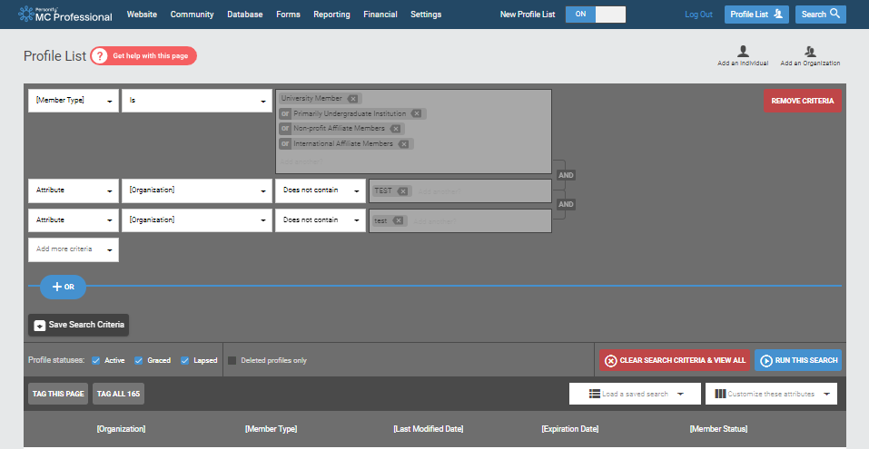
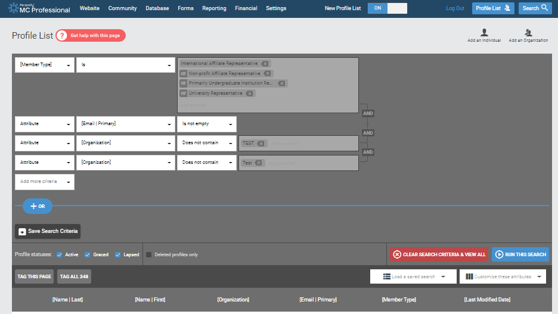
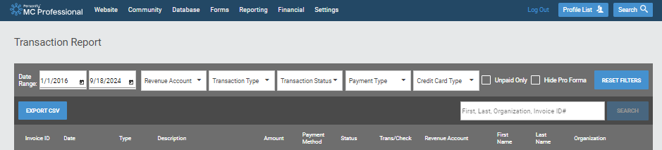

# Analysis workflow for membership and representative tracking in MemberClicks

## Overview of process

Make an annotated visual here (with text) that describes the process in the pipeline.

## Retrieval of relevant exports in MC

All inputs to this pipeline are generated through MemberClicks exports through the [CUAHSI administrator account](https://cuahsi.memberclicks.net/administrator#/login), and must be stored in [1_fetch/src/in](1_fetch/src/in) prior to starting the analysis workflow. Below is a description of each of the MC exports.

### Institutions export

[Link to query institution profiles](https://cuahsi.memberclicks.net/administrator/index.php?option=com_mcprofilelist&view=list&pageNumber=1&sortBy=2021&sortDirection=&searchUUID=5b47ae46-2ae1-4a69-94ec-638f573fee8f)

### Representatives exports

[Link to query representative profiles](https://cuahsi.memberclicks.net/administrator/index.php?option=com_mcprofilelist&view=list&pageNumber=4&sortBy=2019&sortDirection=&searchUUID=25e47ded-bdf2-4753-ac39-61a3f81b4d75)

### Transaction export

[Link to query transactions](https://cuahsi.memberclicks.net/administrator/index.php?option=com_mctransactionreport)

## Execution of analysis workflow

This data analysis workflow uses Snakemake (installation instructions [here](https://snakemake.readthedocs.io/en/stable/getting_started/installation.html)) as a pipelining tool for this analysis workflow. 

First, create a Conda environment with all the required packages by running the following command: `conda env create -f environment.yaml`

Once in the new environment, we can execute the snakemake pipeline with this command: `snakemake --cores 1 -s Snakefile.txt`

When the jobs are done, a CSV tracking membership will be in a newly created `out` folder in [4_process](4_process) and a list of representatives (and current organization active/graced/lapsed) status will be in a newly created `out` folder in [5_munge_representatives](5_munge_representatives).

