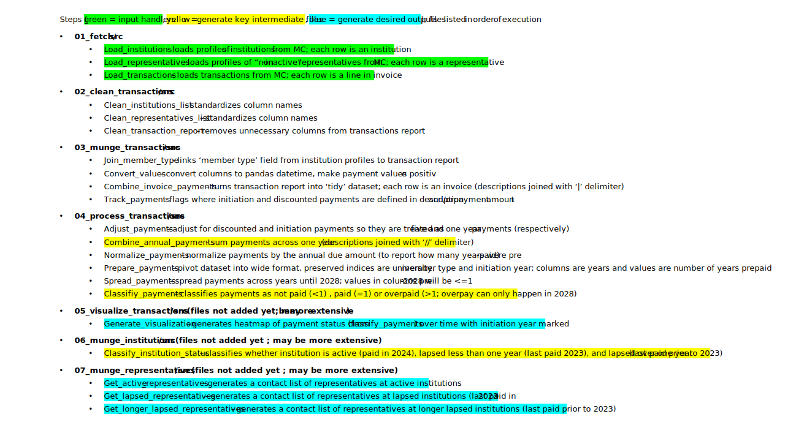

# Analysis workflow for institution and representative membership tracking in MemberClicks

## Retrieval of relevant exports in MC

All inputs to this pipeline are generated through MemberClicks exports through the [CUAHSI administrator account](https://cuahsi.memberclicks.net/administrator#/login), and must be stored in [1_fetch/src/in](1_fetch/src/in) prior to starting the analysis workflow. Snapshots of example input queries can be found in the [images/inputs](images/inputs) folder.

## Code architecture

## Execution of analysis workflow

This data analysis workflow uses Snakemake (installation instructions [here](https://snakemake.readthedocs.io/en/stable/getting_started/installation.html)) as a pipelining tool for this analysis workflow. 

First, create a Conda environment with all the required packages by running the following command: `conda env create -f environment.yaml`

Once in the new environment, we can execute the snakemake pipeline with this command: `snakemake --cores 1 -s Snakefile.smk` (note this file is currently not working)

When the jobs are done, the desired outputs are:
- A heatmap of institution payment status over time; see `out` folder in [05_visualize_transactions](05_visualize_transactions)

- A contact list of represntatives at active, lapsed, and long lapsed institutions for communications; see `out` folder in [07_munge_representatives](07_munge_representatives)

